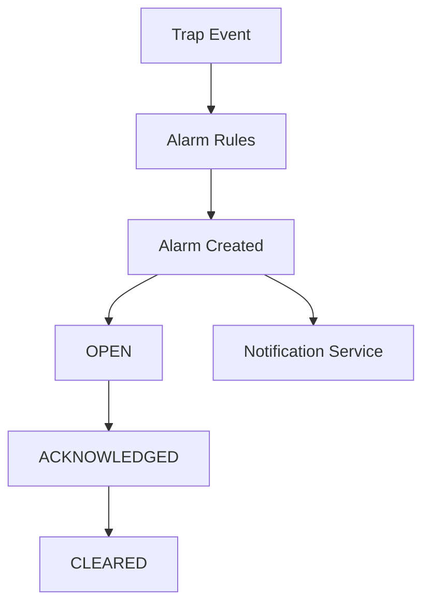

# Alarm Management Flow

```mermaid
flowchart TD
    Trap[Trap Event] --> Rules[Alarm Rules]
    Rules --> Alarm[Alarm Created]
    Alarm --> Open[OPEN]
    Open --> Ack[ACKNOWLEDGED]
    Ack --> Clear[CLEARED]
    Alarm --> Notify[Notification Service]
```

Alarm management transforms raw notifications into lifecycle objects that operators can acknowledge and clear.
