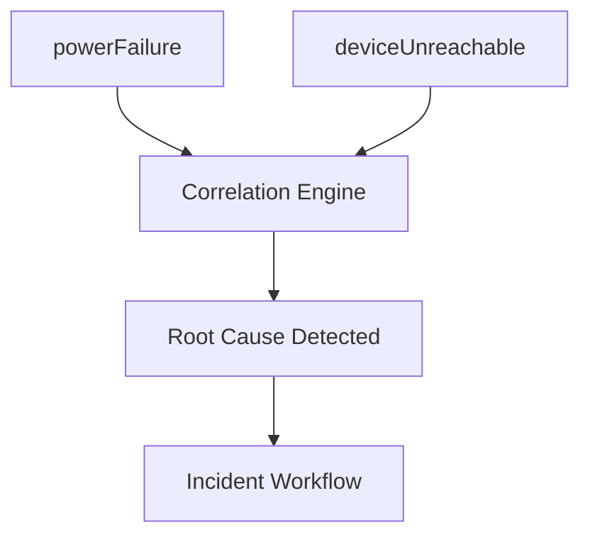

# Event Correlation Flow

```mermaid
flowchart TD
    PF[powerFailure] --> Correlator[Correlation Engine]
    DU[deviceUnreachable] --> Correlator
    Correlator --> RCA[Root Cause Detected]
    RCA --> Incident[Incident Workflow]
```

Correlation connects the source fault with downstream symptoms so the NOC avoids duplicate tickets and alert storms.
