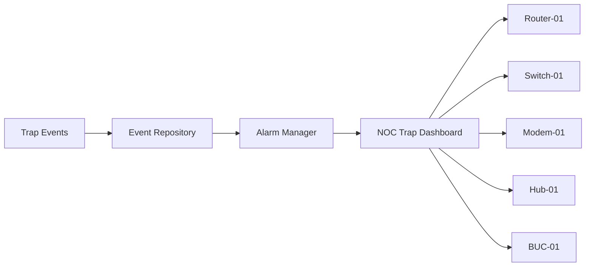

# NOC Dashboard Architecture

```mermaid
flowchart LR
    Events[Trap Events] --> Repo[Event Repository]
    Repo --> Alarms[Alarm Manager]
    Alarms --> Dashboard[NOC Trap Dashboard]
    Dashboard --> Router[Router-01]
    Dashboard --> Switch[Switch-01]
    Dashboard --> Modem[Modem-01]
    Dashboard --> Hub[Hub-01]
    Dashboard --> BUC[BUC-01]
```

The dashboard presents a compact operations view that combines trap counts, alarm counts, and impacted devices.
