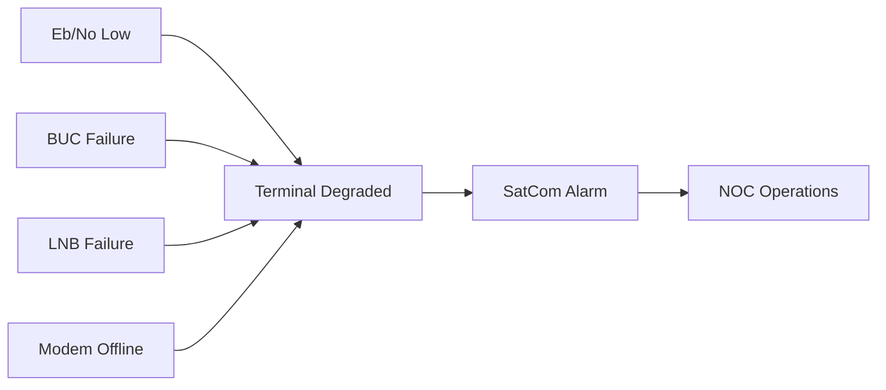

# SatCom Fault Management

```mermaid
flowchart LR
    EbNo[Eb/No Low] --> Terminal[Terminal Degraded]
    BUC[BUC Failure] --> Terminal
    LNB[LNB Failure] --> Terminal
    Modem[Modem Offline] --> Terminal
    Terminal --> Alarm[SatCom Alarm]
    Alarm --> NOC[NOC Operations]
```

SatCom fault management emphasizes signal quality and RF path integrity because service availability depends on both.
