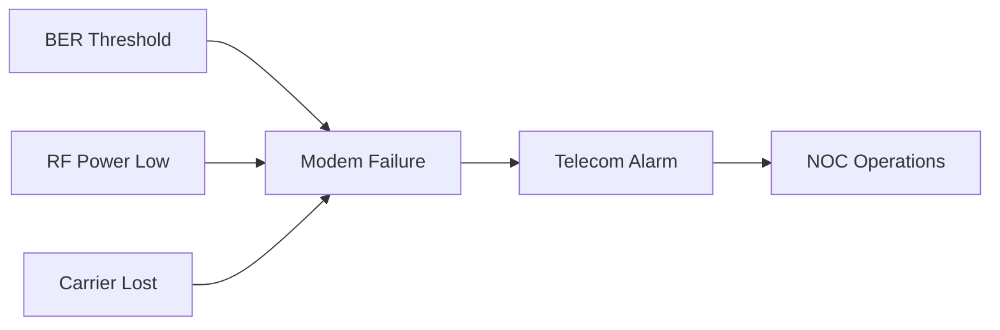

# Telecom Fault Management

```mermaid
flowchart LR
    BER[BER Threshold] --> Modem[Modem Failure]
    RF[RF Power Low] --> Modem
    Carrier[Carrier Lost] --> Modem
    Modem --> Alarm[Telecom Alarm]
    Alarm --> NOC[NOC Operations]
```

Telecom monitoring ties RF metrics to service-impacting alarms so operators can quickly identify degrading transport conditions.
