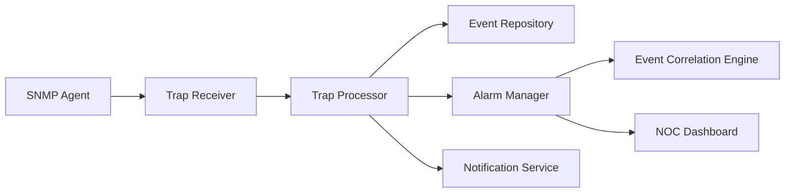

# Trap Architecture

```mermaid
flowchart LR
    Agent[SNMP Agent] --> Receiver[Trap Receiver]
    Receiver --> Processor[Trap Processor]
    Processor --> Repository[Event Repository]
    Processor --> AlarmMgr[Alarm Manager]
    AlarmMgr --> Correlator[Event Correlation Engine]
    AlarmMgr --> NOC[NOC Dashboard]
    Processor --> Notify[Notification Service]
```

The architecture keeps ingestion, processing, alarming, and operator presentation separate so each part can evolve without coupling.
