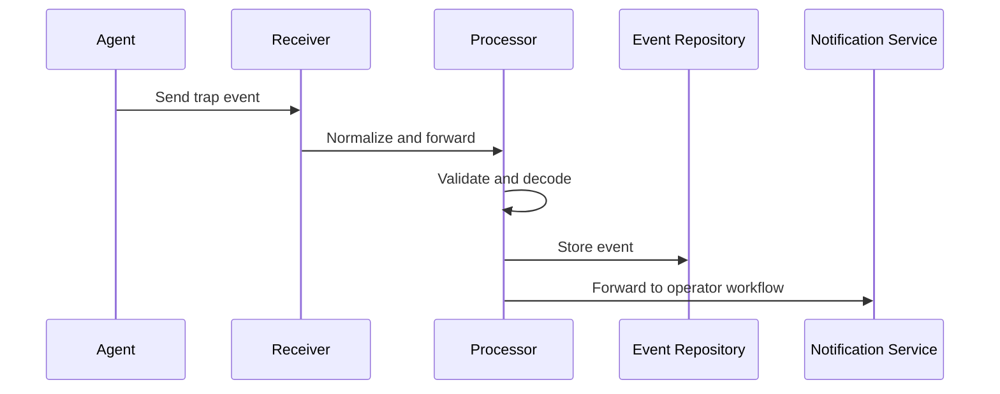

# Trap Processing Flow

```mermaid
sequenceDiagram
    participant Agent
    participant Receiver
    participant Processor
    participant Store as Event Repository
    participant Notify as Notification Service

    Agent->>Receiver: Send trap event
    Receiver->>Processor: Normalize and forward
    Processor->>Processor: Validate and decode
    Processor->>Store: Store event
    Processor->>Notify: Forward to operator workflow
```

This flow mirrors how a real management platform receives asynchronous notifications and enriches them before operational use.
