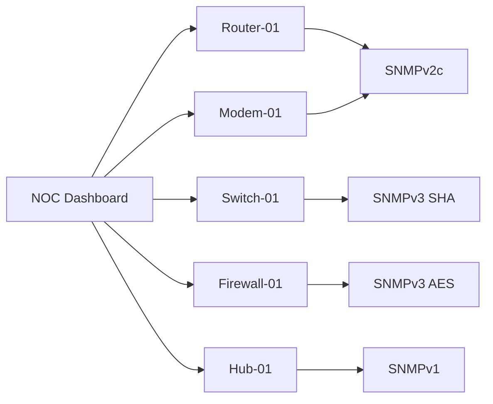

# Secure NOC Architecture

```mermaid
graph LR
    NOC[NOC Dashboard] --> Router[Router-01]
    NOC --> Switch[Switch-01]
    NOC --> Firewall[Firewall-01]
    NOC --> Modem[Modem-01]
    NOC --> Hub[Hub-01]
    Router --> V2C[SNMPv2c]
    Switch --> V3SHA[SNMPv3 SHA]
    Firewall --> V3AES[SNMPv3 AES]
    Modem --> V2C
    Hub --> V1[SNMPv1]
```
