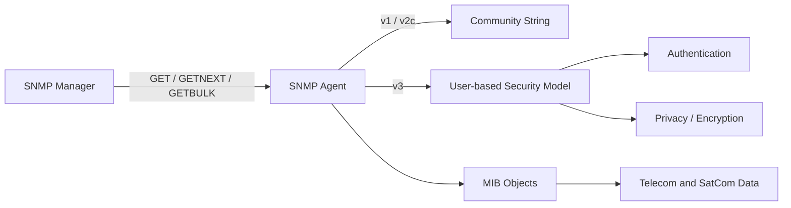

# SNMP Version Architecture

```mermaid
graph LR
    Manager[SNMP Manager] -->|GET / GETNEXT / GETBULK| Agent[SNMP Agent]
    Agent -->|v1 / v2c| Community[Community String]
    Agent -->|v3| USM[User-based Security Model]
    USM --> Auth[Authentication]
    USM --> Priv[Privacy / Encryption]
    Agent --> MIB[MIB Objects]
    MIB --> Telemetry[Telecom and SatCom Data]
```
