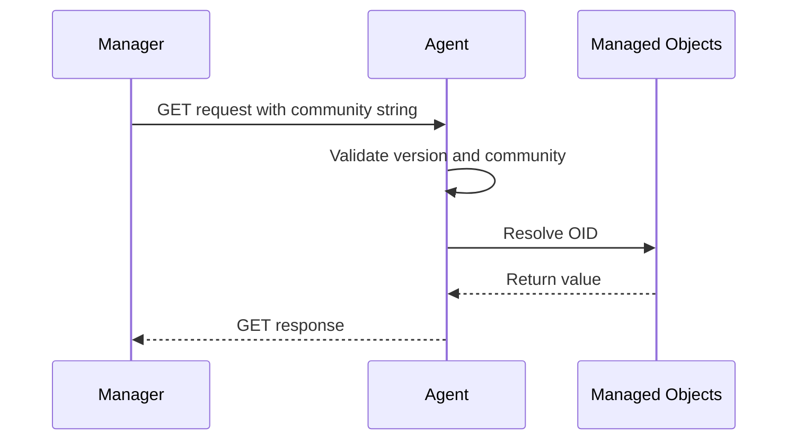

# SNMPv1 Workflow

```mermaid
sequenceDiagram
    participant M as Manager
    participant A as Agent
    participant MIB as Managed Objects

    M->>A: GET request with community string
    A->>A: Validate version and community
    A->>MIB: Resolve OID
    MIB-->>A: Return value
    A-->>M: GET response
```
