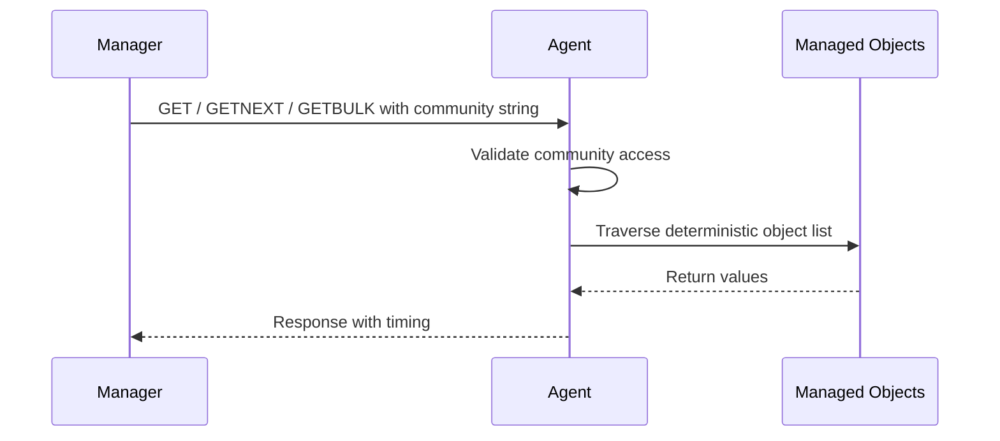

# SNMPv2c Workflow

```mermaid
sequenceDiagram
    participant M as Manager
    participant A as Agent
    participant MIB as Managed Objects

    M->>A: GET / GETNEXT / GETBULK with community string
    A->>A: Validate community access
    A->>MIB: Traverse deterministic object list
    MIB-->>A: Return values
    A-->>M: Response with timing
```
