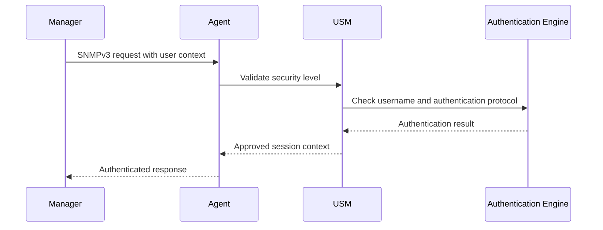

# SNMPv3 Authentication Flow

```mermaid
sequenceDiagram
    participant M as Manager
    participant A as Agent
    participant USM as USM
    participant Auth as Authentication Engine

    M->>A: SNMPv3 request with user context
    A->>USM: Validate security level
    USM->>Auth: Check username and authentication protocol
    Auth-->>USM: Authentication result
    USM-->>A: Approved session context
    A-->>M: Authenticated response
```
