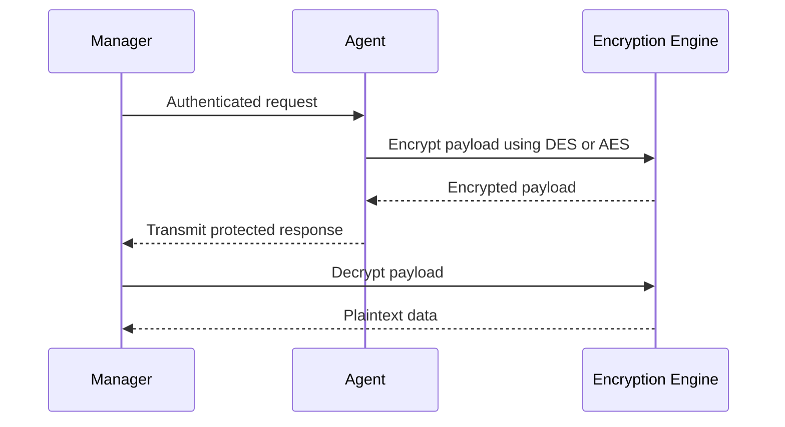

# SNMPv3 Encryption Flow

```mermaid
sequenceDiagram
    participant M as Manager
    participant A as Agent
    participant Enc as Encryption Engine

    M->>A: Authenticated request
    A->>Enc: Encrypt payload using DES or AES
    Enc-->>A: Encrypted payload
    A-->>M: Transmit protected response
    M->>Enc: Decrypt payload
    Enc-->>M: Plaintext data
```
