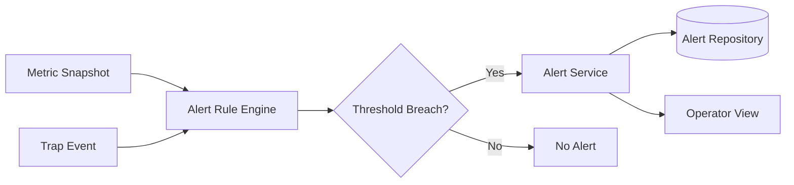

# Alert Engine

```mermaid
graph LR
    Metric[Metric Snapshot] --> Rules[Alert Rule Engine]
    Trap[Trap Event] --> Rules
    Rules --> Decision{Threshold Breach?}
    Decision -- Yes --> Service[Alert Service]
    Service --> Store[(Alert Repository)]
    Service --> Notify[Operator View]
    Decision -- No --> Clear[No Alert]
```
