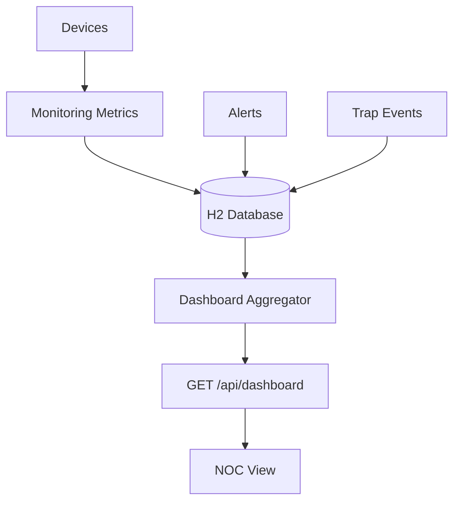

# Dashboard Architecture

```mermaid
graph TD
    Devices[Devices] --> Metrics[Monitoring Metrics]
    Metrics --> DB[(H2 Database)]
    Alerts[Alerts] --> DB
    Traps[Trap Events] --> DB
    DB --> Agg[Dashboard Aggregator]
    Agg --> API[GET /api/dashboard]
    API --> NOC[NOC View]
```
