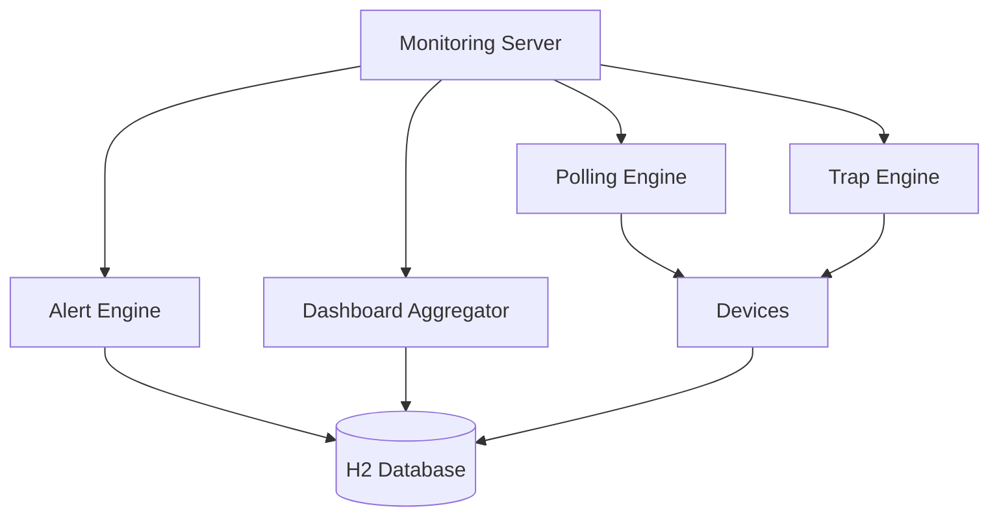
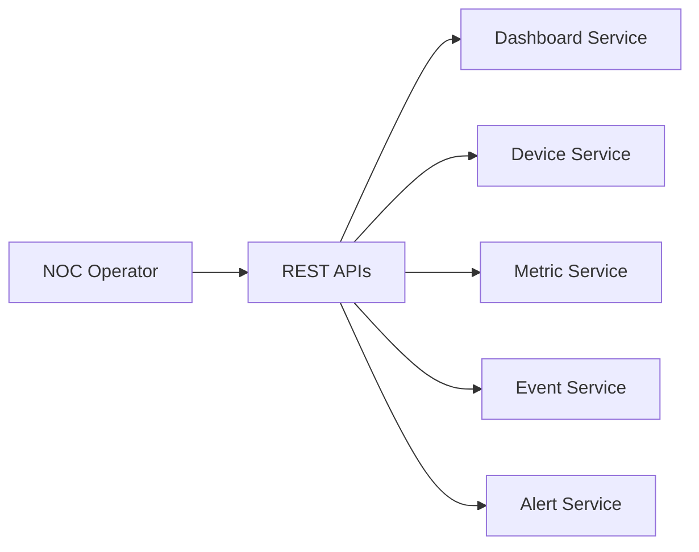

# Monitoring Architecture

```mermaid
graph TD
    A[Monitoring Server] --> B[Polling Engine]
    A --> C[Trap Engine]
    A --> D[Alert Engine]
    A --> E[Dashboard Aggregator]
    B --> F[Devices]
    C --> F
    D --> G[(H2 Database)]
    E --> G
    F --> G
```

```mermaid
flowchart LR
    NOC[NOC Operator] --> API[REST APIs]
    API --> DASH[Dashboard Service]
    API --> DEV[Device Service]
    API --> MET[Metric Service]
    API --> EVT[Event Service]
    API --> ALT[Alert Service]
```
