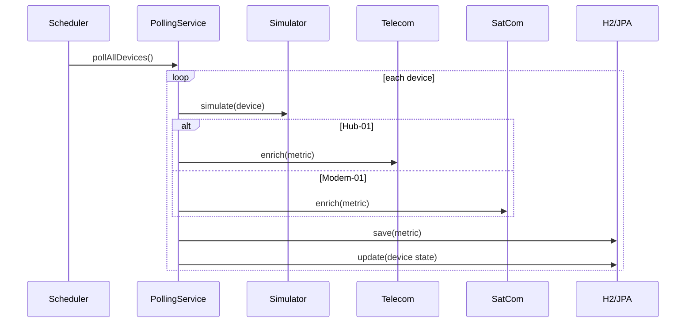

# Polling Workflow

```mermaid
sequenceDiagram
    participant Scheduler
    participant PollingService
    participant Simulator
    participant Telecom
    participant SatCom
    participant JPA as H2/JPA

    Scheduler->>PollingService: pollAllDevices()
    loop each device
        PollingService->>Simulator: simulate(device)
        alt Hub-01
            PollingService->>Telecom: enrich(metric)
        else Modem-01
            PollingService->>SatCom: enrich(metric)
        end
        PollingService->>JPA: save(metric)
        PollingService->>JPA: update(device state)
    end
```
