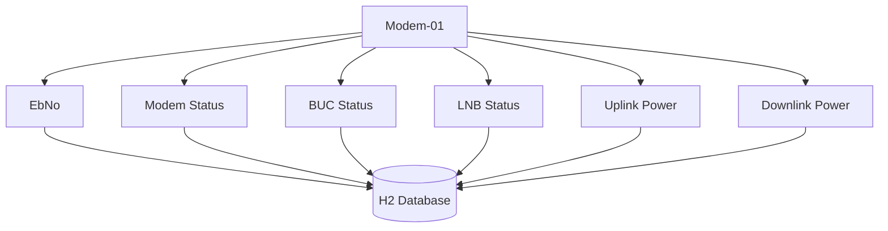

# SatCom Monitoring Flow

```mermaid
flowchart TD
    Modem[Modem-01] --> EbNo[EbNo]
    Modem --> Status[Modem Status]
    Modem --> BUC[BUC Status]
    Modem --> LNB[LNB Status]
    Modem --> Up[Uplink Power]
    Modem --> Down[Downlink Power]
    EbNo --> DB[(H2 Database)]
    Status --> DB
    BUC --> DB
    LNB --> DB
    Up --> DB
    Down --> DB
```
