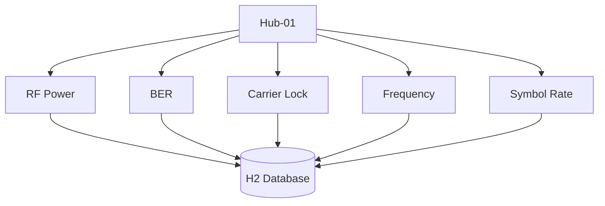

# Telecom Monitoring Flow

```mermaid
flowchart TD
    Hub[Hub-01] --> RF[RF Power]
    Hub --> BER[BER]
    Hub --> Lock[Carrier Lock]
    Hub --> Freq[Frequency]
    Hub --> Rate[Symbol Rate]
    RF --> DB[(H2 Database)]
    BER --> DB
    Lock --> DB
    Freq --> DB
    Rate --> DB
```
