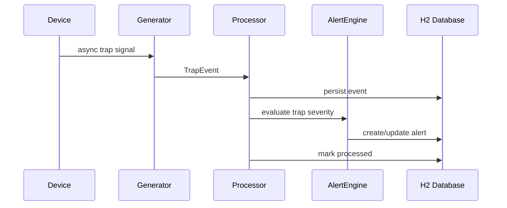

# Trap Processing

```mermaid
sequenceDiagram
    participant Device
    participant Generator
    participant Processor
    participant AlertEngine
    participant DB as H2 Database

    Device->>Generator: async trap signal
    Generator->>Processor: TrapEvent
    Processor->>DB: persist event
    Processor->>AlertEngine: evaluate trap severity
    AlertEngine->>DB: create/update alert
    Processor->>DB: mark processed
```
