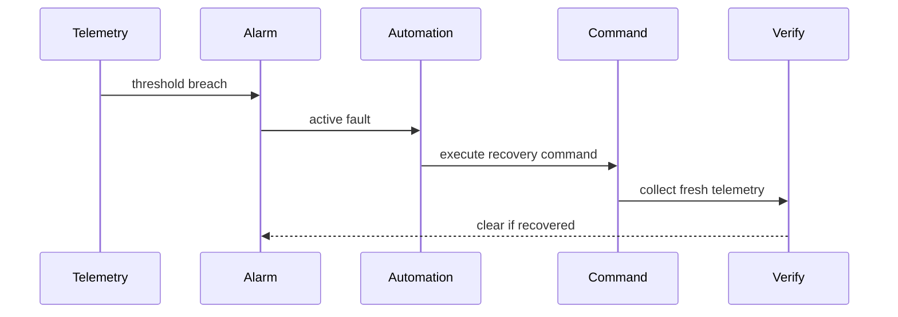

# Closed-Loop Automation

```mermaid
sequenceDiagram
    participant Telemetry
    participant Alarm
    participant Automation
    participant Command
    participant Verify

    Telemetry->>Alarm: threshold breach
    Alarm->>Automation: active fault
    Automation->>Command: execute recovery command
    Command->>Verify: collect fresh telemetry
    Verify-->>Alarm: clear if recovered
```
