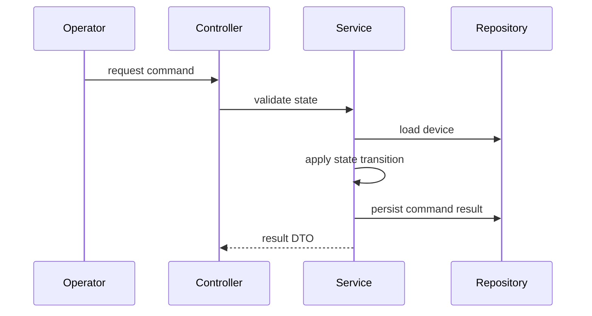

# Command Execution Sequence

```mermaid
sequenceDiagram
    participant Operator
    participant Controller
    participant Service
    participant Repository

    Operator->>Controller: request command
    Controller->>Service: validate state
    Service->>Repository: load device
    Service->>Service: apply state transition
    Service->>Repository: persist command result
    Service-->>Controller: result DTO
```
