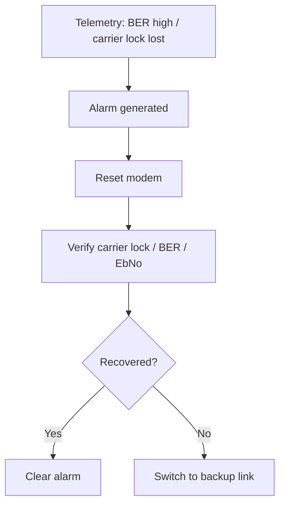

# SatCom Control Workflow

```mermaid
flowchart TD
    A[Telemetry: BER high / carrier lock lost] --> B[Alarm generated]
    B --> C[Reset modem]
    C --> D[Verify carrier lock / BER / EbNo]
    D --> E{Recovered?}
    E -->|Yes| F[Clear alarm]
    E -->|No| G[Switch to backup link]
```
