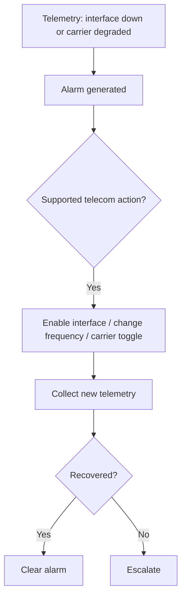

# Telecom Control Workflow

```mermaid
flowchart TD
    A[Telemetry: interface down or carrier degraded] --> B[Alarm generated]
    B --> C{Supported telecom action?}
    C -->|Yes| D[Enable interface / change frequency / carrier toggle]
    D --> E[Collect new telemetry]
    E --> F{Recovered?}
    F -->|Yes| G[Clear alarm]
    F -->|No| H[Escalate]
```
