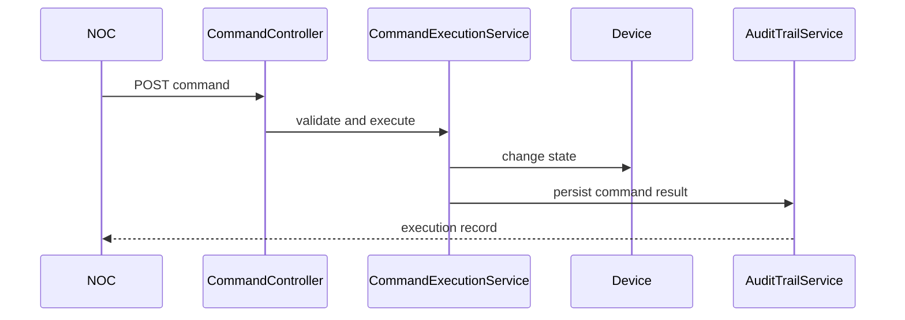

# Telecommand Flow

```mermaid
sequenceDiagram
    participant NOC
    participant API as CommandController
    participant Exec as CommandExecutionService
    participant Device
    participant Audit as AuditTrailService

    NOC->>API: POST command
    API->>Exec: validate and execute
    Exec->>Device: change state
    Exec->>Audit: persist command result
    Audit-->>NOC: execution record
```
