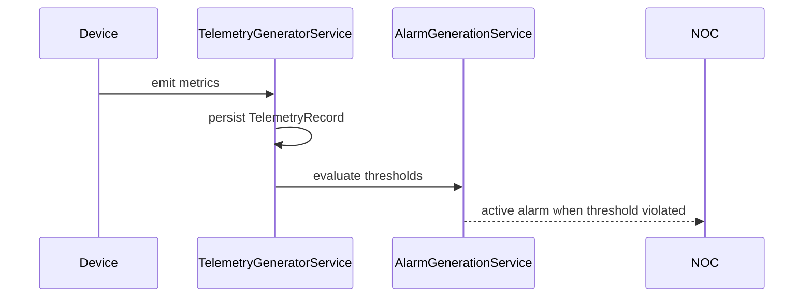

# Telemetry Flow

```mermaid
sequenceDiagram
    participant Device
    participant Service as TelemetryGeneratorService
    participant Alarm as AlarmGenerationService
    participant NOC

    Device->>Service: emit metrics
    Service->>Service: persist TelemetryRecord
    Service->>Alarm: evaluate thresholds
    Alarm-->>NOC: active alarm when threshold violated
```
