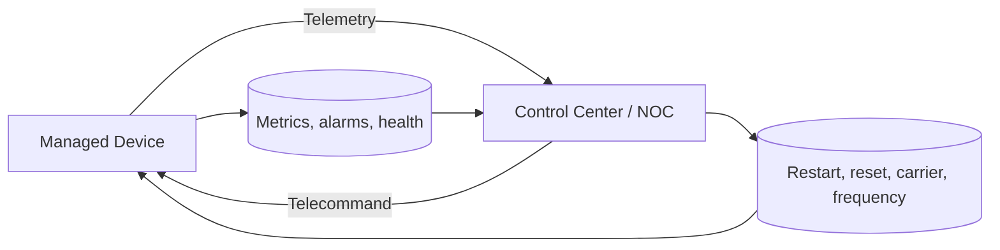

# Telemetry vs Telecommand

```mermaid
flowchart LR
    Device[Managed Device] -->|Telemetry| NOC[Control Center / NOC]
    NOC -->|Telecommand| Device
    Telemetry[(Metrics, alarms, health)]
    Commands[(Restart, reset, carrier, frequency)]
    Device --> Telemetry --> NOC
    NOC --> Commands --> Device
```
