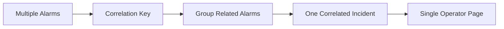

# Alarm Correlation

```mermaid
flowchart LR
    A[Multiple Alarms] --> B[Correlation Key]
    B --> C[Group Related Alarms]
    C --> D[One Correlated Incident]
    D --> E[Single Operator Page]
```
