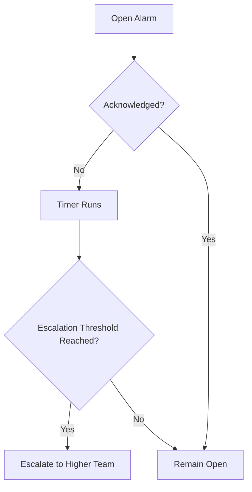

# Alarm Escalation Flow

```mermaid
flowchart TD
    A[Open Alarm] --> B{Acknowledged?}
    B -- No --> C[Timer Runs]
    C --> D{Escalation Threshold Reached?}
    D -- Yes --> E[Escalate to Higher Team]
    D -- No --> F[Remain Open]
    B -- Yes --> F
```
