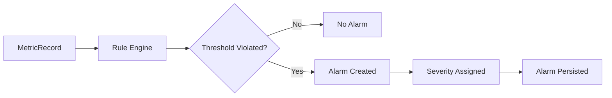

# Alarm Generation Flow

```mermaid
flowchart LR
    A[MetricRecord] --> B[Rule Engine]
    B --> C{Threshold Violated?}
    C -- No --> D[No Alarm]
    C -- Yes --> E[Alarm Created]
    E --> F[Severity Assigned]
    F --> G[Alarm Persisted]
```
