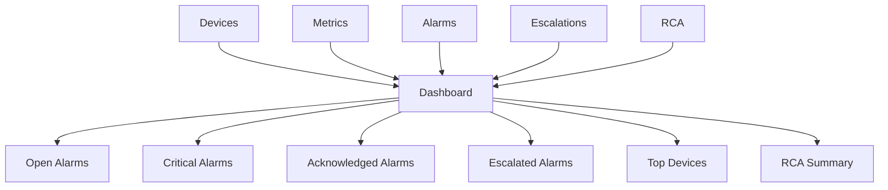

# NOC Alarm Dashboard

```mermaid
flowchart TB
    A[Devices] --> D[Dashboard]
    B[Metrics] --> D
    C[Alarms] --> D
    E[Escalations] --> D
    F[RCA] --> D
    D --> G[Open Alarms]
    D --> H[Critical Alarms]
    D --> I[Acknowledged Alarms]
    D --> J[Escalated Alarms]
    D --> K[Top Devices]
    D --> L[RCA Summary]
```
