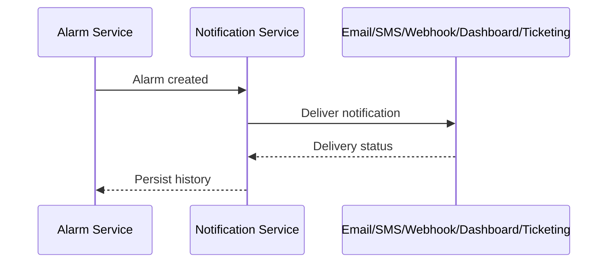

# Notification Workflow

```mermaid
sequenceDiagram
    participant S as Alarm Service
    participant N as Notification Service
    participant E as Email/SMS/Webhook/Dashboard/Ticketing
    S->>N: Alarm created
    N->>E: Deliver notification
    E-->>N: Delivery status
    N-->>S: Persist history
```
