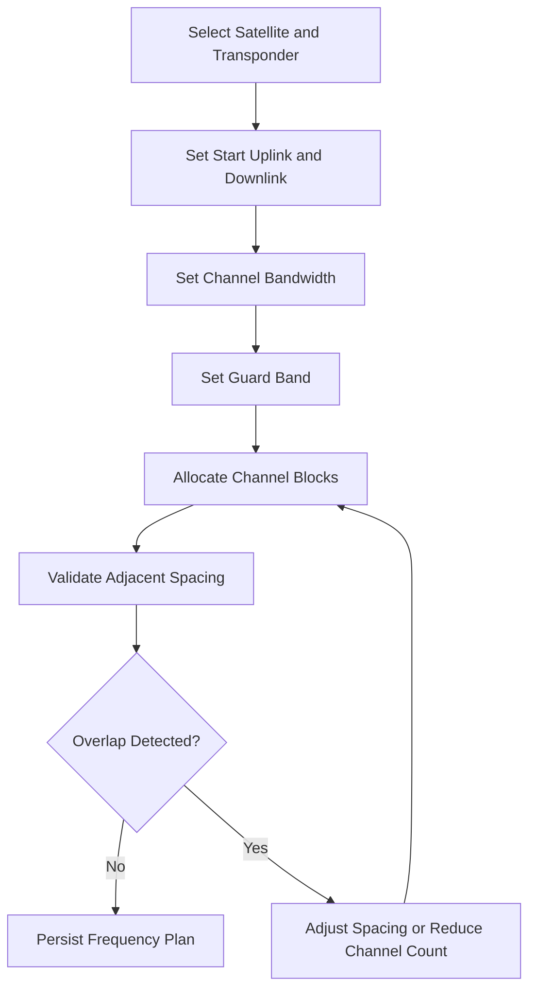

# Frequency Planning Flow

```mermaid
flowchart TD
    A[Select Satellite and Transponder] --> B[Set Start Uplink and Downlink]
    B --> C[Set Channel Bandwidth]
    C --> D[Set Guard Band]
    D --> E[Allocate Channel Blocks]
    E --> F[Validate Adjacent Spacing]
    F --> G{Overlap Detected?}
    G -->|No| H[Persist Frequency Plan]
    G -->|Yes| I[Adjust Spacing or Reduce Channel Count]
    I --> E
```
