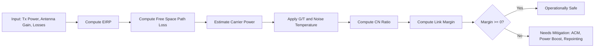

# Link Budget Workflow

```mermaid
flowchart LR
    A[Input: Tx Power, Antenna Gain, Losses] --> B[Compute EIRP]
    B --> C[Compute Free Space Path Loss]
    C --> D[Estimate Carrier Power]
    D --> E[Apply G/T and Noise Temperature]
    E --> F[Compute CN Ratio]
    F --> G[Compute Link Margin]
    G --> H{Margin >= 0?}
    H -->|Yes| I[Operationally Safe]
    H -->|No| J[Needs Mitigation: ACM, Power Boost, Repointing]
```
