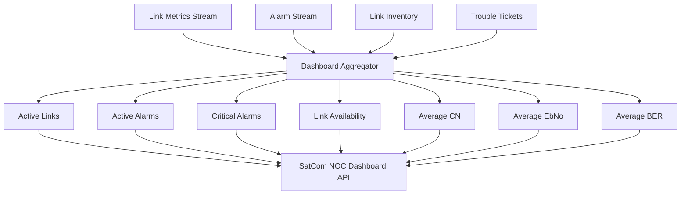

# NOC Dashboard Architecture

```mermaid
graph TD
    MET[Link Metrics Stream] --> AGG[Dashboard Aggregator]
    ALM[Alarm Stream] --> AGG
    LNK[Link Inventory] --> AGG
    RCA[Trouble Tickets] --> AGG

    AGG --> K1[Active Links]
    AGG --> K2[Active Alarms]
    AGG --> K3[Critical Alarms]
    AGG --> K4[Link Availability]
    AGG --> K5[Average CN]
    AGG --> K6[Average EbNo]
    AGG --> K7[Average BER]

    K1 --> UI[SatCom NOC Dashboard API]
    K2 --> UI
    K3 --> UI
    K4 --> UI
    K5 --> UI
    K6 --> UI
    K7 --> UI
```
