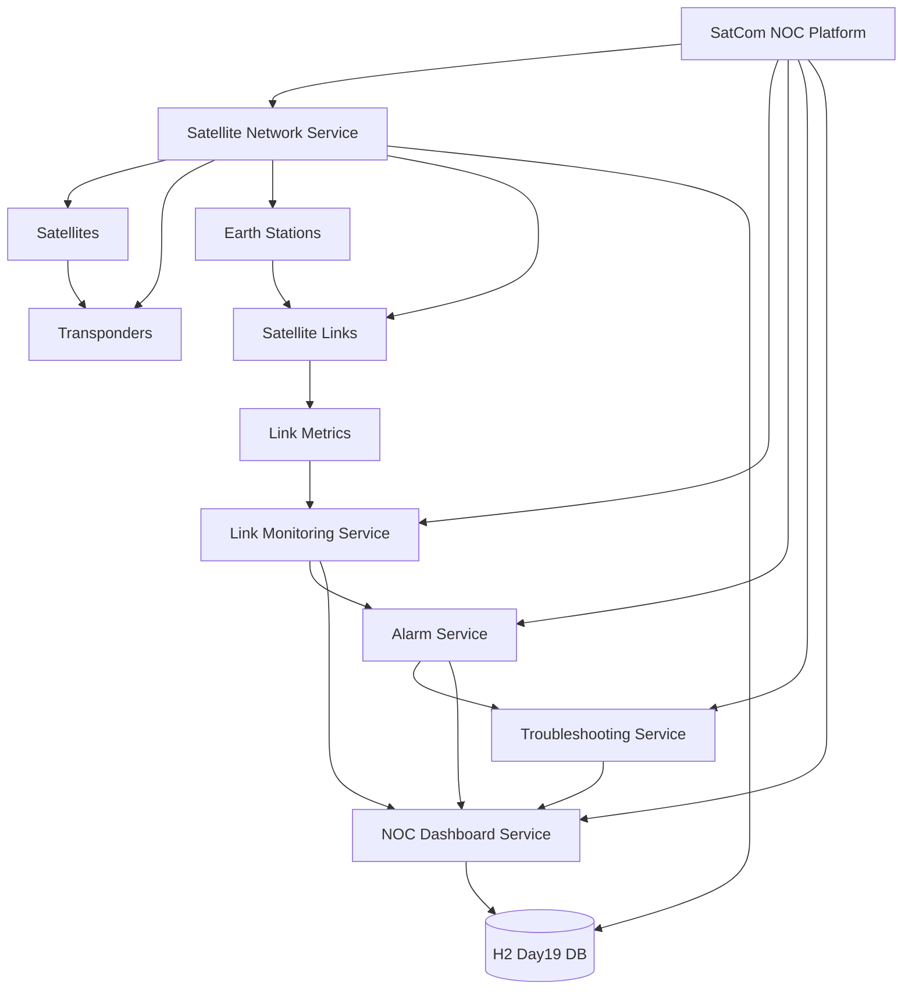

# SatCom Architecture

```mermaid
graph TD
    NOC[SatCom NOC Platform] --> INV[Satellite Network Service]
    NOC --> MON[Link Monitoring Service]
    NOC --> ALM[Alarm Service]
    NOC --> RCA[Troubleshooting Service]
    NOC --> DASH[NOC Dashboard Service]

    INV --> SAT[Satellites]
    INV --> TP[Transponders]
    INV --> ES[Earth Stations]
    INV --> LNK[Satellite Links]

    SAT --> TP
    ES --> LNK
    LNK --> MET[Link Metrics]
    MET --> MON
    MON --> ALM
    ALM --> RCA
    MON --> DASH
    ALM --> DASH
    RCA --> DASH
    DASH --> DB[(H2 Day19 DB)]
    INV --> DB
```
