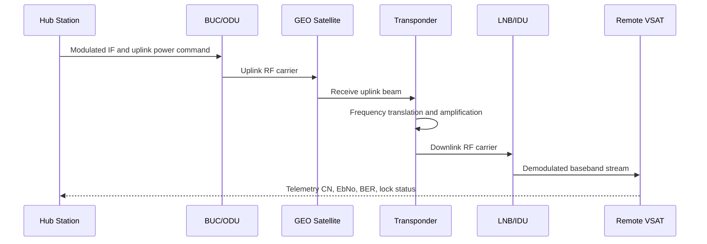

# Uplink Downlink Flow

```mermaid
sequenceDiagram
    participant HUB as Hub Station
    participant BUC as BUC/ODU
    participant SAT as GEO Satellite
    participant TP as Transponder
    participant LNB as LNB/IDU
    participant VSAT as Remote VSAT

    HUB->>BUC: Modulated IF and uplink power command
    BUC->>SAT: Uplink RF carrier
    SAT->>TP: Receive uplink beam
    TP->>TP: Frequency translation and amplification
    TP->>LNB: Downlink RF carrier
    LNB->>VSAT: Demodulated baseband stream
    VSAT-->>HUB: Telemetry CN, EbNo, BER, lock status
```
