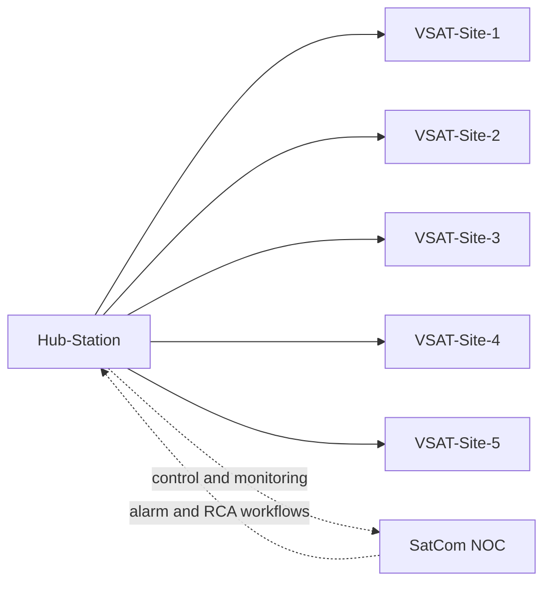

# VSAT Topology

```mermaid
graph LR
    HUB[Hub-Station] --> S1[VSAT-Site-1]
    HUB --> S2[VSAT-Site-2]
    HUB --> S3[VSAT-Site-3]
    HUB --> S4[VSAT-Site-4]
    HUB --> S5[VSAT-Site-5]

    HUB -.control and monitoring.-> NOC[SatCom NOC]
    NOC -.alarm and RCA workflows.-> HUB
```
