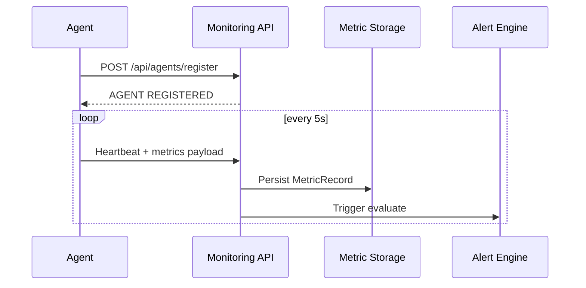

# Agent Data Flow

```mermaid
sequenceDiagram
    participant Agent
    participant API as Monitoring API
    participant Store as Metric Storage
    participant AE as Alert Engine

    Agent->>API: POST /api/agents/register
    API-->>Agent: AGENT REGISTERED
    loop every 5s
      Agent->>API: Heartbeat + metrics payload
      API->>Store: Persist MetricRecord
      API->>AE: Trigger evaluate
    end
```
