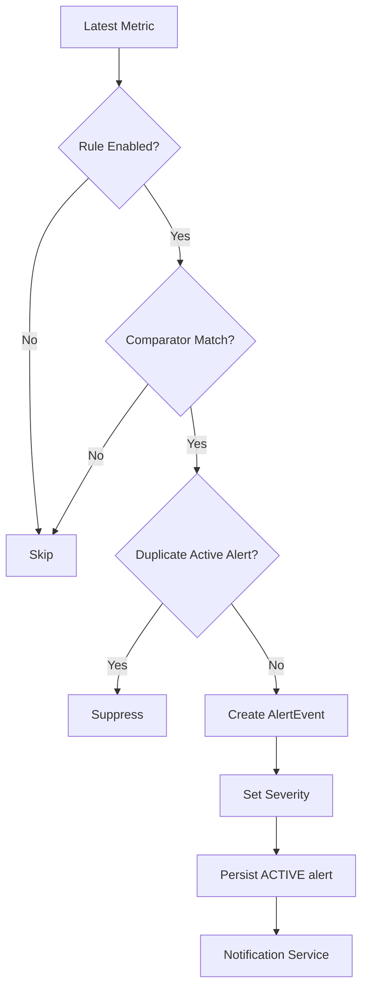

# Alert Processing Flow

```mermaid
flowchart TD
    A[Latest Metric] --> B{Rule Enabled?}
    B -- No --> Z[Skip]
    B -- Yes --> C{Comparator Match?}
    C -- No --> Z
    C -- Yes --> D{Duplicate Active Alert?}
    D -- Yes --> E[Suppress]
    D -- No --> F[Create AlertEvent]
    F --> G[Set Severity]
    G --> H[Persist ACTIVE alert]
    H --> I[Notification Service]
```
