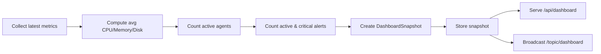

# Dashboard Update Workflow

```mermaid
flowchart LR
    A[Collect latest metrics] --> B[Compute avg CPU/Memory/Disk]
    B --> C[Count active agents]
    C --> D[Count active & critical alerts]
    D --> E[Create DashboardSnapshot]
    E --> F[Store snapshot]
    F --> G[Serve /api/dashboard]
    F --> H[Broadcast /topic/dashboard]
```
