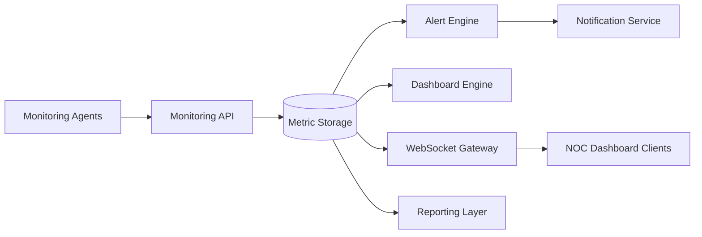

# Monitoring Architecture

```mermaid
graph LR
    A[Monitoring Agents] --> B[Monitoring API]
    B --> C[(Metric Storage)]
    C --> D[Alert Engine]
    C --> E[Dashboard Engine]
    C --> F[WebSocket Gateway]
    C --> G[Reporting Layer]
    D --> H[Notification Service]
    F --> I[NOC Dashboard Clients]
```
