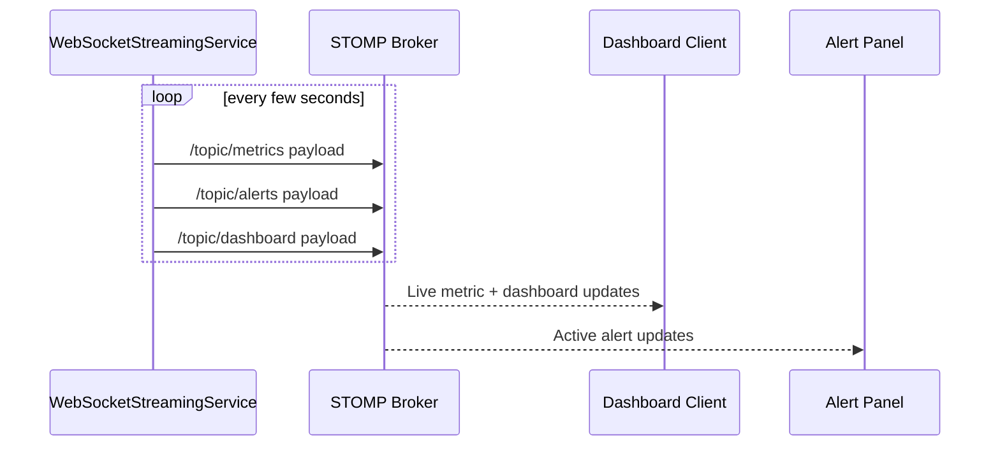

# WebSocket Broadcasting Flow

```mermaid
sequenceDiagram
    participant WS as WebSocketStreamingService
    participant MB as STOMP Broker
    participant C1 as Dashboard Client
    participant C2 as Alert Panel

    loop every few seconds
      WS->>MB: /topic/metrics payload
      WS->>MB: /topic/alerts payload
      WS->>MB: /topic/dashboard payload
    end
    MB-->>C1: Live metric + dashboard updates
    MB-->>C2: Active alert updates
```
