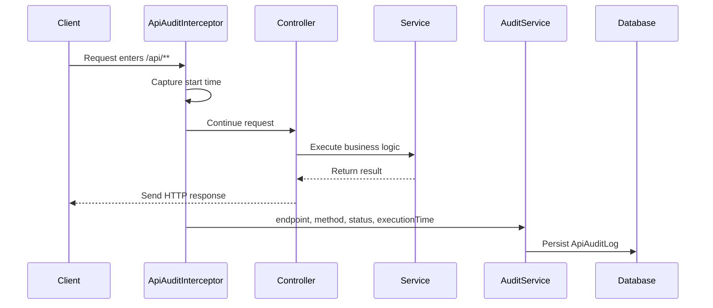

# API Audit Logging Flow

```mermaid
sequenceDiagram
    participant Client
    participant Interceptor as ApiAuditInterceptor
    participant Controller
    participant Service
    participant AuditService
    participant Database

    Client->>Interceptor: Request enters /api/**
    Interceptor->>Interceptor: Capture start time
    Interceptor->>Controller: Continue request
    Controller->>Service: Execute business logic
    Service-->>Controller: Return result
    Controller-->>Client: Send HTTP response
    Interceptor->>AuditService: endpoint, method, status, executionTime
    AuditService->>Database: Persist ApiAuditLog
```
