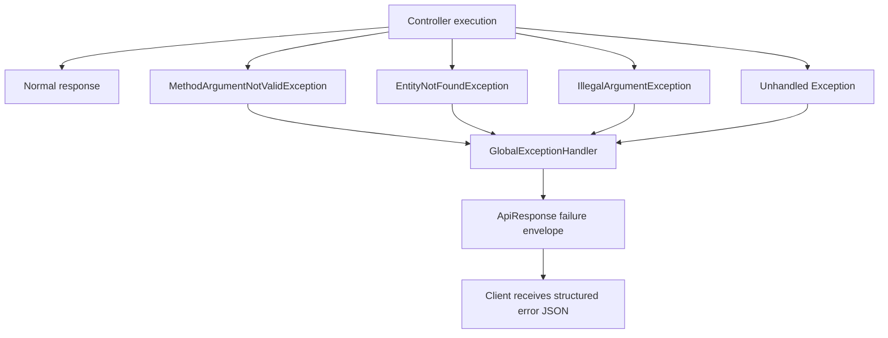

# Exception Handling Flow

```mermaid
flowchart TD
    Controller[Controller execution] --> Success[Normal response]
    Controller --> Mav[MethodArgumentNotValidException]
    Controller --> NotFound[EntityNotFoundException]
    Controller --> Illegal[IllegalArgumentException]
    Controller --> Unexpected[Unhandled Exception]
    Mav --> Handler[GlobalExceptionHandler]
    NotFound --> Handler
    Illegal --> Handler
    Unexpected --> Handler
    Handler --> Wrapped[ApiResponse failure envelope]
    Wrapped --> Client[Client receives structured error JSON]
```
