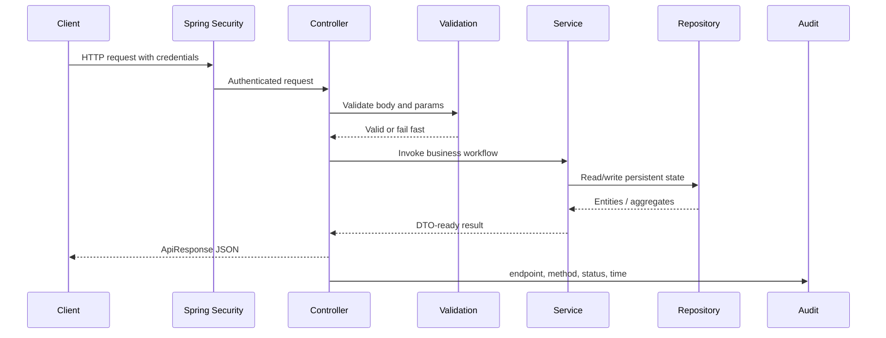

# Request Response Flow

```mermaid
sequenceDiagram
    participant Client
    participant Security as Spring Security
    participant Controller
    participant Validation
    participant Service
    participant Repository
    participant Audit

    Client->>Security: HTTP request with credentials
    Security->>Controller: Authenticated request
    Controller->>Validation: Validate body and params
    Validation-->>Controller: Valid or fail fast
    Controller->>Service: Invoke business workflow
    Service->>Repository: Read/write persistent state
    Repository-->>Service: Entities / aggregates
    Service-->>Controller: DTO-ready result
    Controller-->>Client: ApiResponse JSON
    Controller->>Audit: endpoint, method, status, time
```
