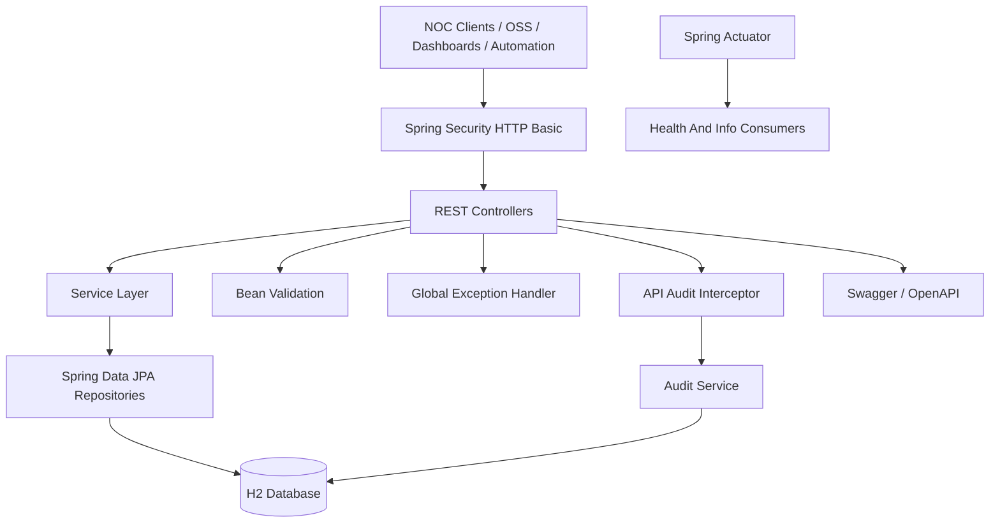

# REST API Architecture

```mermaid
graph TD
    Client[NOC Clients / OSS / Dashboards / Automation] --> Security[Spring Security HTTP Basic]
    Security --> Controllers[REST Controllers]
    Controllers --> Services[Service Layer]
    Services --> Repositories[Spring Data JPA Repositories]
    Repositories --> H2[(H2 Database)]
    Controllers --> Validation[Bean Validation]
    Controllers --> Exception[Global Exception Handler]
    Controllers --> Audit[API Audit Interceptor]
    Audit --> AuditService[Audit Service]
    AuditService --> H2
    Controllers --> OpenAPI[Swagger / OpenAPI]
    Actuator[Spring Actuator] --> Ops[Health And Info Consumers]
```
