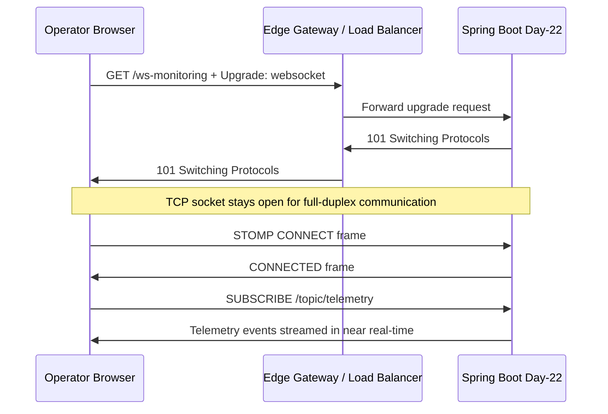

# Diagram 1 - WebSocket Handshake

```mermaid
sequenceDiagram
    participant Client as Operator Browser
    participant LB as Edge Gateway / Load Balancer
    participant App as Spring Boot Day-22

    Client->>LB: GET /ws-monitoring + Upgrade: websocket
    LB->>App: Forward upgrade request
    App->>LB: 101 Switching Protocols
    LB->>Client: 101 Switching Protocols

    Note over Client,App: TCP socket stays open for full-duplex communication

    Client->>App: STOMP CONNECT frame
    App->>Client: CONNECTED frame
    Client->>App: SUBSCRIBE /topic/telemetry
    App->>Client: Telemetry events streamed in near real-time
```
