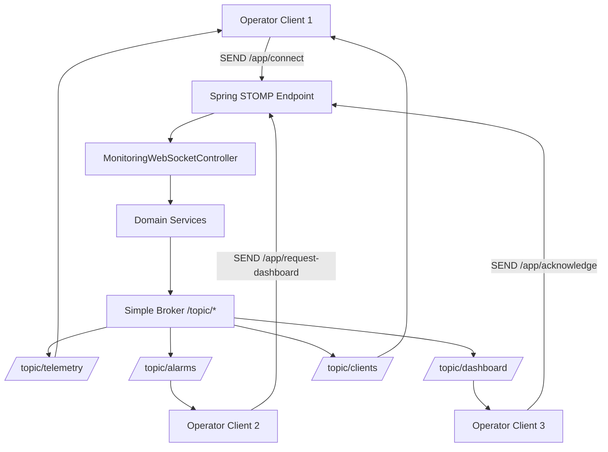

# Diagram 2 - STOMP Architecture

```mermaid
graph TD
    C1[Operator Client 1] -->|SEND /app/connect| WS[Spring STOMP Endpoint]
    C2[Operator Client 2] -->|SEND /app/request-dashboard| WS
    C3[Operator Client 3] -->|SEND /app/acknowledge| WS

    WS --> CTRL[MonitoringWebSocketController]
    CTRL --> SVC[Domain Services]

    SVC --> BROKER[Simple Broker /topic/*]
    BROKER --> T1[/topic/telemetry/]
    BROKER --> T2[/topic/alarms/]
    BROKER --> T3[/topic/dashboard/]
    BROKER --> T4[/topic/clients/]

    T1 --> C1
    T2 --> C2
    T3 --> C3
    T4 --> C1
```
