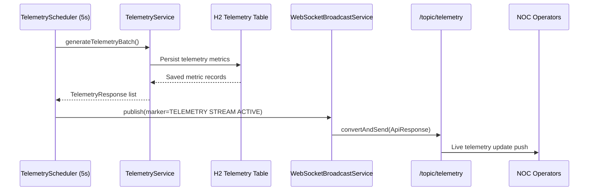

# Diagram 3 - Telemetry Streaming Flow

```mermaid
sequenceDiagram
    participant SCH as TelemetryScheduler (5s)
    participant TS as TelemetryService
    participant DB as H2 Telemetry Table
    participant WS as WebSocketBroadcastService
    participant TOP as /topic/telemetry
    participant OPS as NOC Operators

    SCH->>TS: generateTelemetryBatch()
    TS->>DB: Persist telemetry metrics
    DB-->>TS: Saved metric records
    TS-->>SCH: TelemetryResponse list
    SCH->>WS: publish(marker=TELEMETRY STREAM ACTIVE)
    WS->>TOP: convertAndSend(ApiResponse)
    TOP->>OPS: Live telemetry update push
```
